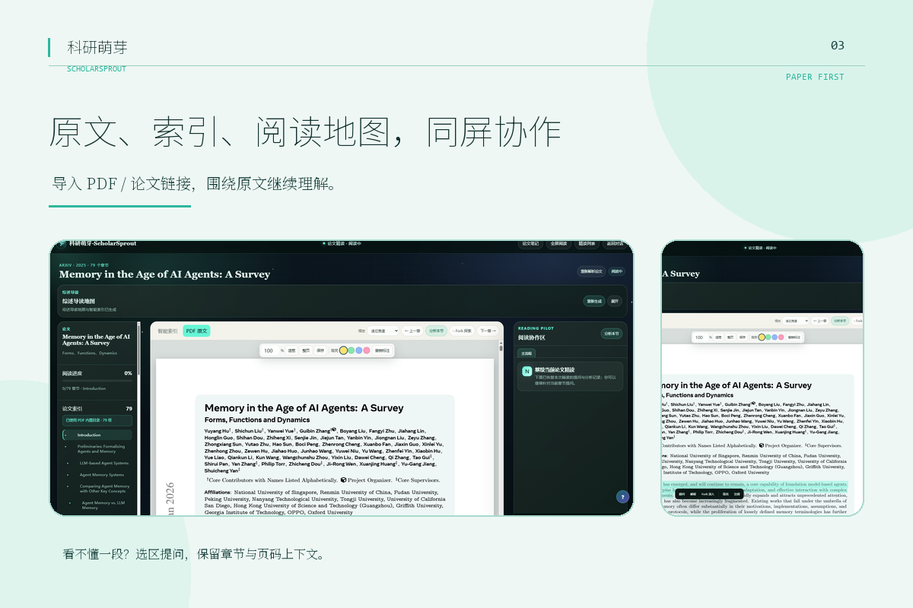

# 科研萌芽 · ScholarSprout

<p align="center">
  
</p>

<p align="center">
  <strong>从论文太多、不知道从哪开始，到一条可以继续走的研究路径。</strong><br>
  面向科研新手的本地优先科研工作台：先理解领域，再进入论文，把问题、对话与阅读痕迹留下来。
</p>

<p align="center">
  <a href="https://github.com/ericernest/ScholarSprout/releases/tag/v1.0.0">下载 Windows v1.0.0</a>
  ·
  <a href="docs/product-tour.md">查看产品导览</a>
  ·
  <a href="https://github.com/ericernest/ScholarSprout/issues">反馈建议</a>
</p>

<p align="center">
  <a href="#为什么是-scholarsprout">产品定位</a>
  ·
  <a href="#适合谁">适合谁</a>
  ·
  <a href="#核心功能">核心功能</a>
  ·
  <a href="#看得见的工作台">产品导览</a>
  ·
  <a href="#立即开始">立即开始</a>
  ·
  <a href="#配置">配置</a>
</p>

> 如果你刚开始接触一个方向，从“领域入门”开始；如果手上已经有 PDF，可以直接进入“论文精读”。

## 为什么是 ScholarSprout？

科研的难点不只是“让 AI 回答一个问题”，而是把下面几步接起来：

- 方向还没站稳，就被论文列表淹没；
- 打开 PDF 之后，看见了文字，却抓不住问题、方法和证据的关系；
- 一次讨论结束后，标注、笔记和下一步又散落在不同地方。

ScholarSprout 把它们收拢成一条连续的路径：

```text
领域入门 → 论文精读 → 持续讨论 → 研究资产
```

它不是又一个只会输出长答案的聊天框，而是一个帮助你从“我想研究什么”走到“我下一步读什么、问什么、留下什么”的研究工作台。

## 适合谁？

- 第一次进入新领域，需要先建立前置知识和学习顺序的同学；
- 想把论文原文、方法图、章节上下文和自己的判断放在同一条阅读路径上的研究者；
- 希望研究数据默认留在本机、同时保留模型选择自由度的个人或小团队；
- 需要在网页之外，通过飞书继续进行轻量研究对话的使用者。

## 核心功能

科研萌芽围绕“认识领域—理解论文—持续探索”组织科研学习过程。当前以“领域入门”和“论文精读”为两项核心功能，并通过研究对话把两类学习结果继续衔接起来，让一次领域学习或论文阅读不止于单次问答。

### 领域入门：先把方向变成一张地图

输入一个宽泛的研究方向，ScholarSprout 会把陌生领域组织成一张“有前置、有脉络、有路径”的学习图景：

| 能力 | 你会得到什么 |
| --- | --- |
| **前置知识** | 进入方向前需要理解的核心概念与关键论文，帮助补齐知识门槛 |
| **发展路径** | 重要阶段、技术转折与关键工作，理解领域如何发展至今 |
| **概念全景** | 核心问题、主要研究方向及其关系，快速建立整体认知 |
| **学习路线** | 有先后关系的学习步骤，明确“先学什么、再看什么” |
| **论文清单** | 基于真实学术检索结果推荐代表论文，并结合学习阶段给出阅读定位 |

系统通过多源学术检索获取真实论文，再基于筛选后的论文证据组织上述内容；用户可以按学习路线逐步推进，也可以从论文清单直接进入论文精读。

任务会显示阶段与进度，支持中断、失败重试和返回工作台继续查看；推荐论文可以直接加入资料库，或下载 PDF 后进入论文精读。

典型流程：`研究方向 → 前置知识与领域认知 → 学习路线 → 代表论文 → 进入论文精读`

### 论文精读：围绕原文继续理解

论文精读以 PDF 原文为中心，把一篇静态论文变成“可导航、可追问、可深入、可沉淀”的科研学习对象：

- **PDF 解析与差异化阅读地图**：支持论文搜索、PDF URL 和本地文件导入，解析全文、章节、页码、图表及版面信息；针对不同类型论文生成差异化阅读地图，精准解析研究重点：研究型论文聚焦研究问题、核心方法、方法步骤、实验支撑与局限；综述型论文聚焦领域脉络、分类体系、技术路线、代表方法与开放问题。
- **智能索引与前置知识**：为章节生成章节梳理、阅读关键点、新手摘要和导读卡片；同时整理核心概念、相关 baseline 和建议阅读顺序。
- **相关论文与局部分析**：根据当前论文主题和阅读内容推荐 baseline、延伸阅读；支持章节分析、方法与实验拆解。
- **选区即交互入口**：选中 PDF 或结构化正文中的内容后，可以直接提问，系统自动带上页码、章节和相邻原文上下文。
- **阅读沉淀与 Fork 分析**：保存高亮、注释、阅读位置和进度；提供论文级 Markdown 笔记，也可以从章节、选区或公式创建独立分析分支，理解完成后再把关键结论带回主流程。

论文精读中的 Reading Pilot 像一位阅读领航员：它会结合当前论文、章节、选区和会话状态，把问题交给最合适的专业 Skill。不是让一个通用聊天框包打天下，而是让每个难点都找到对应的研究助手。

#### 八大专业 Skill：读到哪里，问对谁

| 专业 Skill | 它帮你解决什么 |
| --- | --- |
| **Method Analyst** | 拆解研究方法、方法步骤与实验逻辑 |
| **Math Verifier** | 核对公式、推导过程与数学细节 |
| **Critique Agent** | 审视论证、实验设计、证据和局限 |
| **Code Reviewer** | 解释实现、伪代码和工程风险 |
| **Domain Expert** | 补齐背景概念、术语和领域脉络 |
| **Writing Coach** | 梳理摘要、结构与科研表达 |
| **Idea Generator** | 从当前论文出发生成研究问题与后续方向 |
| **Cross-Paper Linker** | 连接 baseline、技术路线与跨论文关系 |

### 研究对话：让问题留在研究上下文里

- 支持 Markdown、公式、代码块和表格；
- 模型回答实时流式输出，可随时中断；
- 可选择一个或多个领域入门结果、论文精读结果作为“当前讨论”范围，Agent 按需读取对应研究资料；
- 支持围绕单篇论文持续追问，也支持把多篇论文或领域结果放在同一次讨论中比较和整理；
- 从其他页面返回后，继续显示并增量更新尚未完成的回答；
- 可选接入飞书机器人：通过 WebSocket 长连接接收私聊文本，并与网页会话共享同一套研究对话 Agent。

### 研究资料库：让读过的东西留下来

- 统一管理会话、领域入门任务、论文和精读记录；
- 用文件夹组织论文，恢复阅读状态并继续精读；
- 自动合并重复记录，保留论文来源、PDF 状态和关联上下文；
- 将一次领域探索、一次论文阅读和后续讨论连接起来，方便下一次继续使用。

## 看得见的工作台

> **想完整看一遍产品路径？** 打开[产品导览](docs/product-tour.md)，6 张横版截图会从“进入 → 探索 → 精读 → 沉淀”串起完整体验。

下面只保留三张最能说明产品主线的横版截图。

### 先把一个领域变成地图

从前置知识、发展脉络、概念全景和论文入口开始，找到“下一篇该读什么”。


### 再回到论文原文

PDF、目录、智能索引和阅读协作区放在同一个工作台里；不懂一段，就保留章节与页码上下文直接提问。



### 最后把阅读变成研究资产

高亮、注释、进度、笔记、当前讨论和资料库不再是一次性产物，而是下一轮研究的起点。


## 立即开始

### Windows 版

从 [v1 Release](https://github.com/ericernest/ScholarSprout/releases/tag/v1.0.0) 下载任一版本：

| 版本 | 文件 | 适合场景 |
| --- | --- | --- |
| **快速启动目录版（推荐）** | `ScholarSprout-v1.0.0-windows-x64-portable.zip` | 完整解压后双击 `ScholarSprout.exe`；启动快，移动时需要保留整个文件夹 |
| **单文件版** | `ScholarSprout-v1.0.0-windows-x64.exe` | 只需携带一个 exe，适合直接分发和携带 |

两种版本均为 Windows x64 免安装程序，已包含 Python 运行时、Web 前端、PDF 解析依赖和飞书 SDK。使用者不需要安装 Python、Node.js 或其它环境，只需准备一个 OpenAI 兼容的大模型 API（建议使用 DeepSeek V4 Flash）。

程序默认监听 `127.0.0.1:8000`；如果端口被占用，会在 `8001-8099` 中选择可用端口并打开浏览器。运行期间可通过系统托盘重新打开页面或选择“退出科研萌芽”。

### 从源码运行

要求 Python 3.11+，请从 `main` 分支克隆：

```bash
git clone --branch main --single-branch https://github.com/ericernest/ScholarSprout.git
cd ScholarSprout
python -m pip install -e .
scholarsprout gateway --host 127.0.0.1 --port 8000
```

打开 <http://127.0.0.1:8000/>。

仓库已包含可直接运行的前端构建产物。只有修改了 `webui/` 时才需要 Node.js 18+ 并重新构建：

```bash
cd webui
npm install
npm run build
```

## 配置

首次启动会进入教程，也可以随时打开 [http://127.0.0.1:8000/settings](http://127.0.0.1:8000/settings)。配置分为“模型与数据”和“多渠道”两个页面。

https://github.com/user-attachments/assets/ceb08d48-7b45-444f-953a-16bdffea01a0

### 基础模型（必填）

| 配置项 | 说明 | 示例 |
| --- | --- | --- |
| Base URL | OpenAI 兼容接口的完整地址 | `https://api.example.com/v1` |
| API Key | 模型服务商提供的密钥，只填写 Key 本身 | `sk-...` |
| 模型名称 | 服务商接口接受的 `model` 参数 | `deepseek-v4-flash` |

API Key 保存在运行科研萌芽的电脑后端，不会在配置页面加载时回传明文。配置文件默认位于当前用户目录下的 `.scholarsprout/config.json`。

### Embedding（可选）

Embedding 用于论文排序与证据匹配。URL 和 API Key 留空时复用基础模型配置；如果服务商不提供 Embedding，可以保持默认，相关能力调用失败时会自动降级，不影响基础对话与论文阅读。

### 数据目录

会话数据库、论文、PDF、图片、标注和笔记默认保存在当前用户的 `.scholarsprout` 目录。配置页支持改为其它绝对路径，例如：

- 默认目录：`%USERPROFILE%\.scholarsprout`；
- 自定义目录示例（会自动创建）：`D:\ScholarSproutData`。

修改数据目录后需要重启科研萌芽，原目录的数据不会自动迁移。

### 飞书机器人（可选）

在“多渠道”页面填写飞书 App ID 和 App Secret。飞书开放平台需要完成：

1. 创建企业自建应用并启用机器人能力；
2. 在事件订阅中选择“使用长连接接收事件”；
3. 添加事件 `im.message.receive_v1`；
4. 开通 `im:message` 和 `im:message.p2p_msg:readonly` 权限；
5. 创建版本并发布最新版本；
6. 将 App ID 和 App Secret 填入科研萌芽，启用后保存并重启程序。

无需公网回调地址。机器人接收文本消息后会复用科研萌芽的研究对话 Agent，回答同时保存在本地会话数据库中。

## 页面入口

| 页面 | 地址 | 用途 |
| --- | --- | --- |
| 首页 | `/` | 开始体验、进入教程和资料库 |
| 研究对话 | `/app` | 日常聊天与研究上下文对话 |
| 领域入门 | `/app/domain-onboarding` | 前置知识、发展路径、概念全景、学习路线和论文清单 |
| 论文精读 | `/app/paper-reading` | PDF、智能索引、研究总览、选区问答和笔记 |
| 资料库 | `/library` | 会话、论文、文件夹和精读记录 |
| 配置 | `/settings` | 模型、数据目录和飞书渠道 |

## 数据与隐私

- 网页配置接口默认只允许本机访问；
- 模型 API Key、飞书密钥和业务数据保存在本地后端；
- 论文内容只会按功能需要发送给用户配置的模型服务；
- 若要迁移数据，请完整备份配置的数据目录。

## 技术栈

- 前端：Vue 3、TypeScript、Vite，以及按页面拆分的兼容层；
- 后端：Python、FastAPI、SQLite；
- PDF：PyMuPDF、PDF.js、KaTeX；
- 模型协议：OpenAI 兼容 API；
- 多渠道：飞书/Lark 长连接；
- 发布：Windows PyInstaller。

## 持续迭代中

科研萌芽 · ScholarSprout 目前处于持续迭代优化中。我们会继续打磨从领域入门、论文精读到研究沉淀的完整体验。

后续将推出第二版，带来更多功能，并上线网页版，让科研学习可以从本地工作台走向更广泛的使用场景。

更多更新，敬请期待。

## License

[MIT License](LICENSE)
