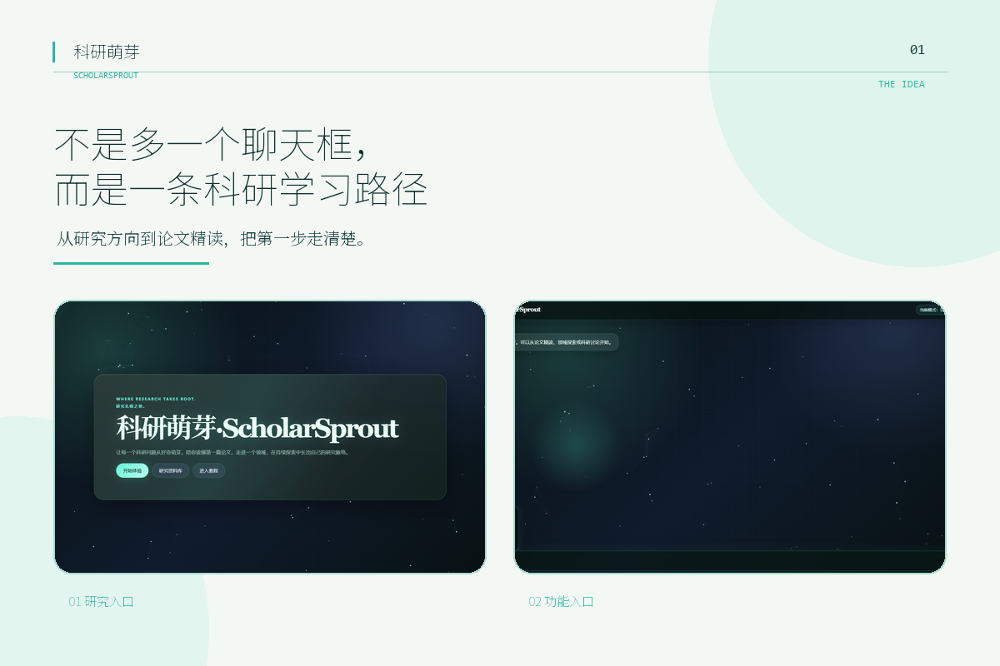
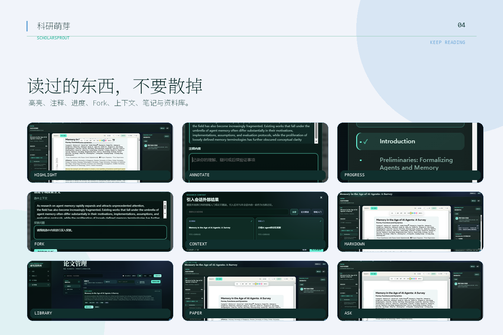

# ScholarSprout 产品导览

[返回 README](../README.md)

README 只展示三张最能说明产品主线的截图；本页保留从“进入”到“沉淀”的完整视觉路径。

## 01 · 从混乱开始

论文越来越多，但研究可以从一条清晰的路径开始：先找到方向，再决定读什么。

  

## 02 · 不是多一个聊天框，而是一条研究路径

从研究方向到论文精读，把第一步走清楚。

  

## 03 · 领域入门：先把领域地图画出来

从前置知识、发展路径、概念全景和学习路线进入一个方向，再连接到代表论文。

  

## 04 · 论文精读：原文、索引与协作同屏

导入 PDF 或论文链接，围绕原文继续理解；看不懂一段，就保留章节和页码上下文直接提问。

  

## 05 · 阅读痕迹：读过的东西不要散掉

高亮、注释、进度、Fork、上下文、Markdown 笔记与资料库，让一次阅读可以成为下一次研究的起点。

  

## 06 · 研究资产：把一次探索留下来

论文、会话、领域入门结果和深入分支集中保存，下一次回来可以接着用。

  

> 图片是产品演示素材；具体功能边界、安装方式和配置要求以 [README](../README.md) 与仓库当前代码为准。
